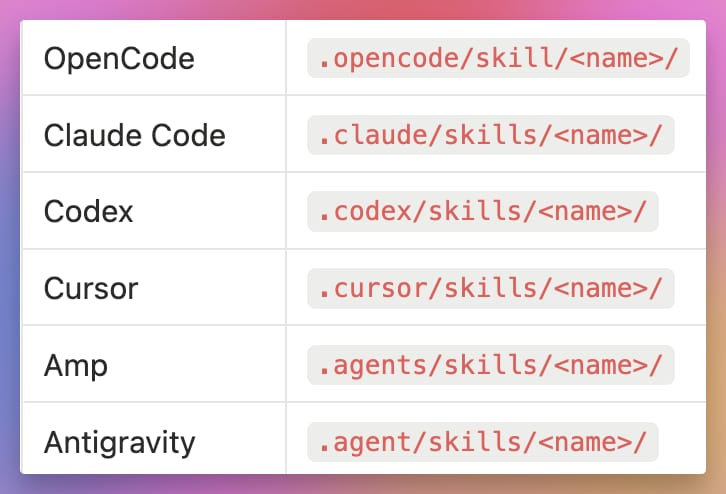

# The missing package manager for AI coding capabilities

OmniDev is a package manager for AI coding capabilities (skills, rules, prompts, hooks, MCP servers). Wrap a GitHub repo or local folder into a versioned capability, then use it across tools (Claude Code, Cursor, Codex, OpenCode, …).

- **Wrap anything** — Point to any GitHub repo or local folder containing skills/rules/prompts and OmniDev wraps it into a capability
- **One config, all tools** — Configure once via `omni.toml`, then generate provider-specific files
- **Profile switching** — Load different capability sets for frontend, backend, planning, etc.
- **Full-featured** — Capabilities can contain skills, rules, commands, subagents, hooks, and MCP servers
- **Capability-local templating** — Use a gitignored capability `.env` to parameterize MCP config and skill content

> Status: **alpha** — breaking changes may occur while features settle.

## Quick Start

```bash
# Install
npm install -g @omnidev-ai/cli

# Initialize in your project
omnidev init

# Add a capability from GitHub
omnidev add cap my-tools --github user/repo

# Check everything is working
omnidev doctor
```

This creates an `omni.toml` configuration file and `.omni/` directory with your capabilities.

**📚 [Read the getting started guide →](https://omnidev.frmtools.com/getting-started/)**

**🔄 Coming from an existing setup?** Check out the [migration guide](https://omnidev.frmtools.com/guides/migration/) and [migration skill](./migration/SKILL.md)

## Provider Support

| Feature | Claude Code | Cursor | Codex | OpenCode |
|---------|:-----------:|:------:|:-----:|:--------:|
| **Skills** | ✅ | ✅ | ✅ | ✅ |
| **Agents** | ✅ | ✅ | ❌ | ✅ |
| **Commands** | ✅* | ✅ | ✅* | ✅ |
| **Hooks** | ✅ | ❌ | ❌ | ❌ |
| **Rules** | ✅ | ✅ | ✅ | ✅ |
| **MCP Servers** | ✅ | ✅ | ✅ | ✅ |

**Notes:**

- **Claude Code & Codex Commands**: Merged into skills (these providers don't have native commands concept)
- **Codex MCP**: Supports `stdio` and `http` transports only (SSE skipped with warning)

## What Can OmniDev Do?

### Manage Capabilities

Install reusable AI capabilities from GitHub or local directories:

```bash
omnidev add cap obsidian --github kepano/obsidian-skills
omnidev add cap my-local --local ./capabilities/custom
```

### Claude Plugin Wrapping

OmniDev can auto-wrap existing `.claude-plugin` directories as capabilities. Point to a repo with a `.claude-plugin/` folder and OmniDev handles the rest—including `hooks.json` parsing and path variable resolution (`${CLAUDE_PLUGIN_ROOT}` → absolute paths).

### Switch Profiles

Use different capability sets for different contexts:

```bash
omnidev profile set frontend   # Load UI/accessibility tools
omnidev profile set backend    # Load database/API tools
```

### Add MCP Servers

Integrate Model Context Protocol servers:

```bash
omnidev add mcp filesystem --command npx --args "-y @modelcontextprotocol/server-filesystem /path"
```

MCP-only environment variables can be set in `omni.toml` with `env = { KEY = "value" }` under `[mcps.<name>]` or via `omnidev add mcp --env KEY=value`.

### Unified Project Instructions

Define your project instructions in `OMNI.md` and OmniDev generates provider-specific files (`CLAUDE.md`, `AGENTS.md`, etc.) automatically.

## Why OmniDev?

Every AI coding tool reinvents the wheel—different folder structures (`.cursor/`, `.claude/`, `.agent/`), different config formats, and they can't even agree on whether it's "skill" or "skills". This makes it painful to share setups with your team or switch between tools.

But it's not just about config locations. **It's also about context.** AI agents work better with focused, task-specific context. You don't want to load database tools when working on UI, or vice versa. Switching between different configurations of hooks, agents, skills, and commands depending on your task is verbose and often ends up as manual work or ad-hoc scripts.

<details>
<summary>Config sprawl (example)</summary>

<br />

<a href="./docs/img/config-sprawl.png">
  
</a>
</details>

## Documentation

- **[Getting Started](https://omnidev.frmtools.com/getting-started/)** — Installation and first steps
- **[Configuration](https://omnidev.frmtools.com/configuration/config-files/)** — Configure capabilities, profiles, and providers
- **[Capabilities](https://omnidev.frmtools.com/capabilities/overview/)** — Create and share capabilities
- **[Commands](https://omnidev.frmtools.com/commands/init/)** — CLI reference
- **[Examples](examples/)** — Sample configurations for different setups

Explore community capabilities at [omnidev-capabilities](https://github.com/frmlabz/omnidev-capabilities).

## Examples

Check out the [examples/](examples/) directory for sample configurations:

- [basic.toml](examples/basic.toml) — Simple single-capability setup
- [profiles.toml](examples/profiles.toml) — Multiple profiles for different contexts
- [mcp.toml](examples/mcp.toml) — MCP server integration

## 🤝 Contributing

We wholeheartedly welcome contributions!
With so many providers and configuration permutations, we rely on your feedback and help to ensure everything runs smoothly.

- **Found a bug or issue?**
  [Open an issue](https://github.com/frmlabz/omnidev/issues) to let us know!
- **Want to submit a pull request?**
  Awesome! Feel free to submit fixes and improvements.
- **Thinking of adding a new feature?**
  **Let's discuss it first!**
  Open an issue to propose your idea so we can chat and plan the best approach.

See [CONTRIBUTING.md](CONTRIBUTING.md) for development setup and architecture.

## License

MIT
